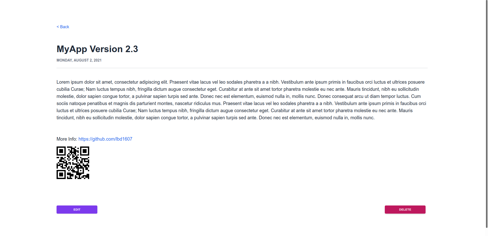

# **Add QR Codes from User Input**

Learn how to use the `qrcodes.react` generator to create QR codes from user input in a Blitz.js app. This tutorial assumes that you've already installed Blitz and created a project. For this example, we're using a model named "Blog".

To learn more about setting up Blitz, refer to the [Blitz.js Documentation](https://blitzjs.com/docs/getting-started).

## Step 1: Install the QR Code Generator

Go to your project folder and install `qrcode.react` as a devDependency:

```
npm i -D qrcode.react
```

## Step 2: Add the QR Code Field to the Prisma Model

Before we start using Blitz to create forms, we need to create a Prisma model and generate the model folders.

Go to **db** and open `schema.Prisma`.

For this tutorial, we'll create a simple blog model that contains a `qrcode` string for the user input later. Add the following field to your model:

```javascript
qrcode    String?
```

> **Note**: If you want to make this field required, remove the optional flag `?` from `String`.

Before continuing to the next step, migrate the database:

```
 blitz prisma migrate dev --preview-feature
```

## Step 3: Configure Mutations

Go to **Blogs/Mutations** and add the new **qrcodes** attribute to **updateBlog.ts** so users can update the URL when they edit the page:

```tsx
qrcode: z.string(),
```

If you want to make the QR code URL a required field, you'll also need to add it to **updateBlog.ts**.

## Step 4: Add the QR Code Field to the Form

Now we can start creating the forms and the main Blogs page. For these, we'll be working in the following files:

- **blogs/components/BlogForm.tsx**: The "Add Blog" form
- **pages/blogs/\[blogId]\.tsx**: The blog page

To run the app, run the command `blitz dev`, then open [localhost:3000](http://localhost:3000).

In **BlogForm.tsx**, add the QR code as a `<LabeledTextField />` with a name of `qrcode`:

```javascript
<LabeledTextField name="qrcode" placeholder="" label="QR Code URL" />
```

When a user enters a URL into this field, it's saved into the database and can also be edited later.

> **Note**: Follow best practices and sanitize user input before allowing it to be posted to any database.

## Step 5: Add the QR Code to the Rendering Page

In **\[blogId]\.tsx**, we'll add the QRCode component so the URL that the user enters is rendered as a QR code.

In the Blog component, create the following variables in the component before the return statement:

```javascript
export const Blog = () => {
 ...

  var React = require("react")
  var QRCode = require("qrcode.react")

  return (
    ...

```

In the body of the return statement where your HTML is rendered, insert the QRCode component:

```javascript
<QRCode value={blog.qrcode || "https://github.com/"} />
```

Typescript requires that the QR code URL is not potentially null. For this example, we've made the GitHub website an alternate URL.

When the page is rendered, the URL that the user entered is rendered as a QR code:


