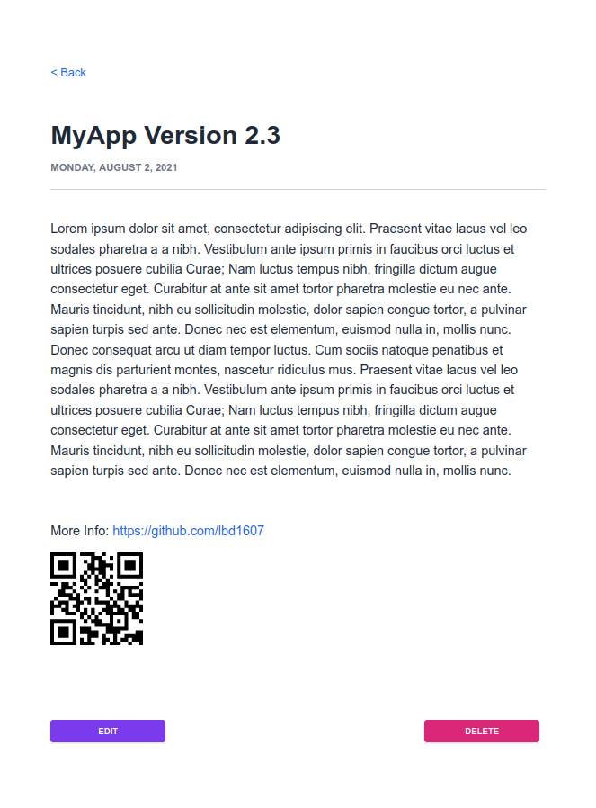

# **Create QR Codes from User Input**

In this guide, you'll learn how to use the `qrcode.react` generator to create QR codes from user input in a Blitz.js app by completing the following steps:

1. Install the QR code generator
1. Add the QR code URL field to the Prisma model
1. Configure mutations
1. Add the user input to the form
1. Add the QR code to the rendering page

<br/>

## Requirements

For this tutorial, we assume that you've already installed Blitz and created a project. To learn more about setting up a Blitz project, refer to the [Blitz.js documentation](https://blitzjs.com/docs/getting-started).

<br/>

## Step 1: Install the QR code generator

Go to your project folder and install `qrcode.react`:

```
npm install qrcode.react
```

<br/>

## Step 2: Add the QR code URL field to the Prisma model

Before you start using Blitz to create forms, you'll need to add a field for the QR code URL to your Prisma model and migrate the database. For this example, we're using a model named "Blog".

1. Open your project in a code editor.

1. Go to the **db** folder and open `schema.Prisma`.

1. Add a field for the QR code URL to your model:

   ```javascript
   qrcode    String?
   ```

   > **Note**: If you want to make this field required, remove the optional flag `?` from `String`.

1. Before continuing to the next step, migrate the database:

   ```
   blitz prisma migrate dev --preview-feature
   ```

<br/>

## Step 3: Configure mutations

Go to **app/blogs/mutations** and add the new **qrcodes** property to **createBlog.ts** and **updateBlog.ts**:

```tsx
qrcode: z.string(),
```

<br/>

## Step 4: Add the user input to the form

Now you can start configuring the form. For this step, you'll be working in the Add Blog form from **blogs/components/BlogForm.tsx**, where you'll add a user input for the QR code URL.

1. To run the app, run the command `blitz dev`, then open [localhost:3000](http://localhost:3000).

1. In **BlogForm.tsx**, add the user input for the QR code URL as a `<LabeledTextField/>` with a name of `qrcode`:

   ```javascript
   <LabeledTextField name="qrcode" label="QR Code URL" />
   ```

> **Caution**: If you're using `dangerouslySetInnerHTML` on your `LabeledTextField` component, you'll need to manually sanitize user input before allowing it to be posted to the database.

<br/>

## Step 5: Add the QR code to the rendering page

For this step, you'll be working in the Blog page from **pages/blogs/\[blogId]\.tsx**, where you'll add the `<QRCode/>` component so the URL that the user entered in the form is rendered as a QR code.

First, go to the Blog component and create the `React` and `QRCode` variables inside the main component before the return statement:

```javascript
export const Blog = () => {
...

  var React = require("react")
  var QRCode = require("qrcode.react")

  return (
    ...

```

Then insert the `<QRCode/>` component inside the return statement where your HTML is rendered:

```javascript
<QRCode value={blog.qrcode} />
```

<br/>

When the page is rendered, the URL that the user entered in the form is rendered as a QR code:

<br/>



<br/>

## More information

- [Blitz.js documentation](https://blitzjs.com/docs/getting-started) - The full documentation for Blitz, including a brief tutorial.
- [qrcode.react](https://github.com/zpao/qrcode.react) - The GitHub project for the `qrcodes.react` QR code generator.
